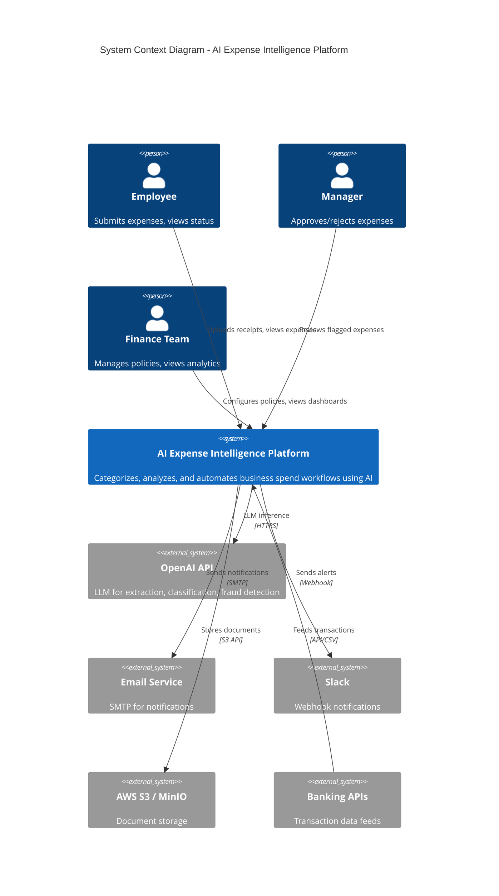
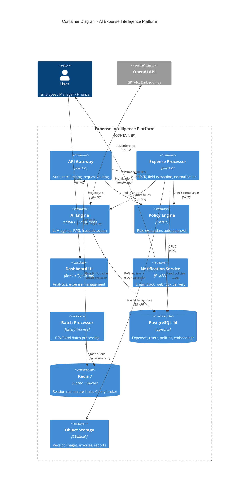
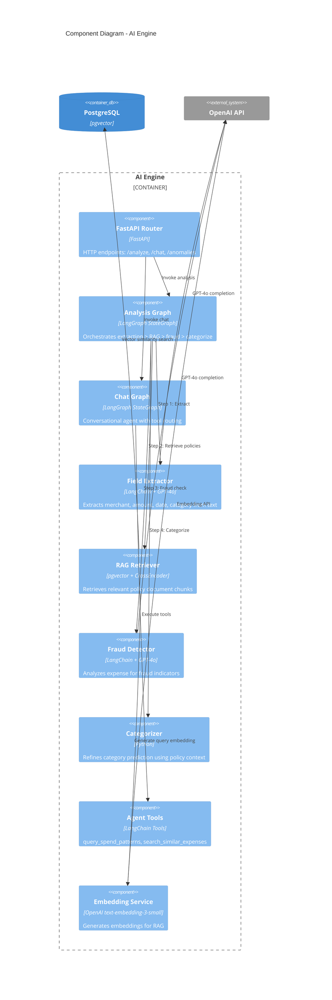
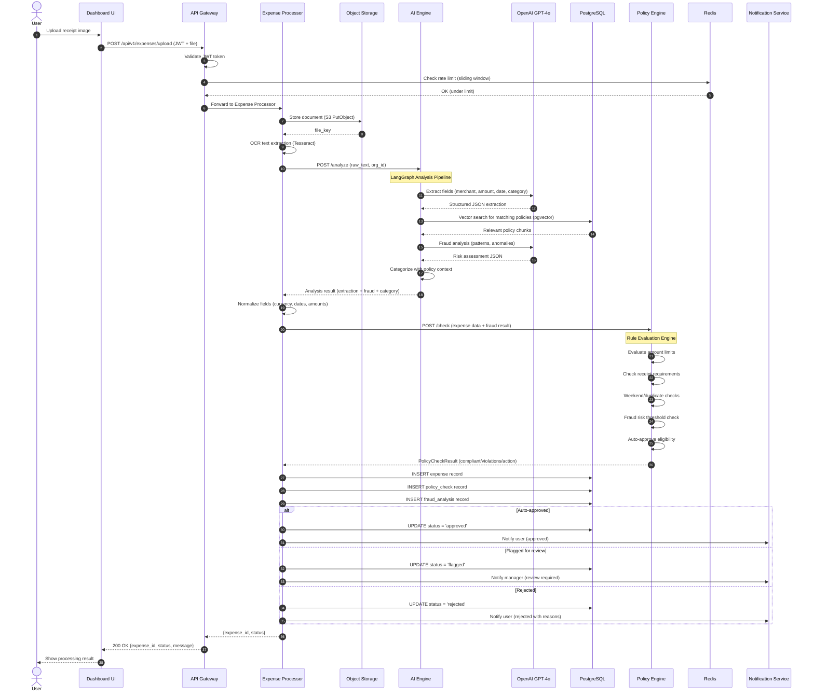
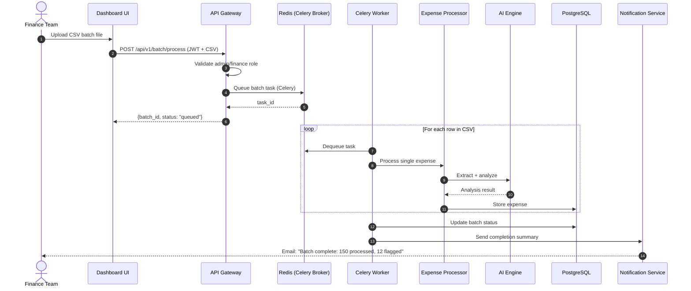
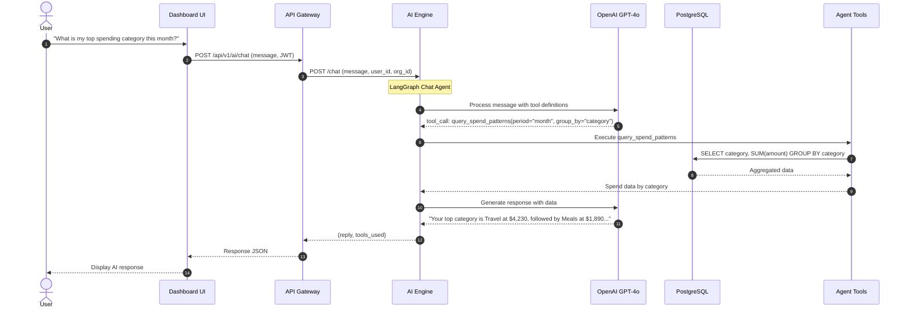
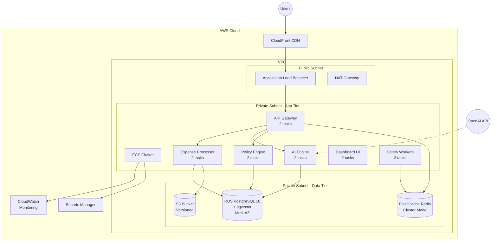

# Architecture Diagrams

## C4 Model - Level 1: System Context

## C4 Model - Level 2: Container Diagram

## C4 Model - Level 3: Component Diagram (AI Engine)

## Sequence Diagram: Expense Upload Flow

## Sequence Diagram: Batch Processing Flow

## Sequence Diagram: AI Chat Flow

## Deployment Architecture

